# 📈 MarketSage: An AI-Powered Stock Prediction System [](https://marketsage-sayantan.streamlit.app/)


MarketSage is a sophisticated, AI-driven application designed to forecast stock prices and deliver comprehensive financial analysis. By integrating a Long Short-Term Memory (LSTM) model to capture sequential patterns with a Transformer network's attention mechanisms, this hybrid system provides robust, data-backed insights. The entire application is built for local execution using Streamlit, ensuring a polished, intuitive, and privacy-focused experience.

---

## ✨ Features at a Glance

- **Hybrid AI Model:** Combines the strengths of LSTM and Transformer architectures for high-fidelity price predictions.
- **Comprehensive Analysis:** Generates a detailed report complete with key insights, risk factors, and essential technical indicators (RSI, MACD, EMAs).
- **AI-Powered Insights:** Integrates with the Google Gemini API to produce a narrative, professional-grade financial analysis that contextualizes market data.
- **Intuitive UI:** A clean, interactive Streamlit dashboard lets users easily select a stock, view historical data, and visualize future predictions.
- **Local & Private:** All models are trained and run on your local machine, ensuring complete data privacy and offline functionality.

---

## 📁 Project Structure

```text
MarketSage/
├── src/
│   ├── app.py          # Main Streamlit application dashboard
│   ├── main.py         # Core model training script
│   └── marketsage.py   # NEW: Interactive setup & run script
├── prompts/
│   └── gemini.txt      # Template for customizing AI-generated insights
├── notebooks/
│   └── ...             # Jupyter notebooks for model prototyping
├── saved_models/
│   └── ...             # Directory for all trained models & data
├── .env.example        # Example for environment variables
└── README.md
```

---
## 📖 Project Documentation

A comprehensive report is available in the `documentation/MarketSage.md` file. It covers:

- Problem definition and motivation
- Related work in stock market prediction
- Detailed methodology (data pipeline, model architectures, hybrid ensemble)
- Experiments, results, and visualizations
- Future enhancements and references

[Open MarketSage.md](documentation/MARKETSAGE.md.md)

---

## 🎨 Customizing AI Insights

You can tailor the AI-generated reports by modifying the `prompts/gemini.txt` file. This template is dynamically filled with real-time stock data.

**How to Use:**

1. Open `prompts/gemini.txt` and edit the content.
2. Use placeholders in curly braces, like `{company_name}` or `{current_price}`, to pull in dynamic data.
3. Supported variables include: `company_name`, `symbol`, `current_price`, `sector`, `model_accuracy`, `predictions_1_week_gain_pct`, `predictions_1_month_gain_pct`, `RSI`, `MACD`, `MACD_Signal`, `EMA20`, `EMA50`, `ATR`, and `recommendation_score`.

---

## 🚀 Getting Started

Follow these steps to set up and run MarketSage on your local machine.

### Step 1: Clone Repository

Open your terminal and clone the repository:

```bash
git clone https://github.com/lazy-coder-03/MarketSage.git
cd MarketSage
```

### Step 2: Interactive Setup & Training

The `marketsage.py` script simplifies the entire workflow. It handles virtual environment creation, dependency installation, model training, and application launch with a single command.

```bash
python src/marketsage.py
```

This script will guide you by asking for a stock symbol (e.g., RELIANCE.NS, TCS), handling various input formats. If a model for that stock already exists, it will prompt you to either use the existing one or retrain it. Once the model is ready, the Streamlit app will automatically launch in your browser.

### Step 3: Configure Gemini API (Optional)

To enable the AI-Powered Insights feature, you will need a Google Gemini API key.

1. Create a copy of `.env.example` and rename it to `.env`.
2. Get your API key from [Google AI Studio](https://aistudio.google.com/app/apikey).
3. Add your key to the `.env` file:

```text
GEMINI_API_KEY="YOUR_API_KEY_HERE"
```

---

## 🤝 Contribution & License

This project is for educational and research purposes only. Feel free to fork the repository, modify the models, and contribute to its development.


---

## 📸 Screenshots

Below are sample screenshots of MarketSage's UI and features:

| Feature | Screenshot |
|---------|------------|
| Welcome Page | 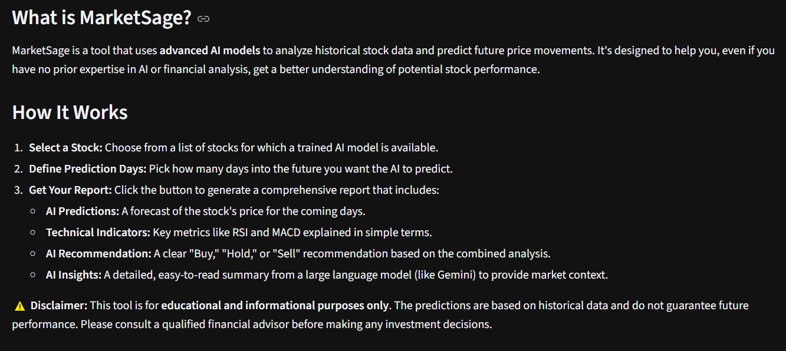 |
| Sidebar & Model Selection | 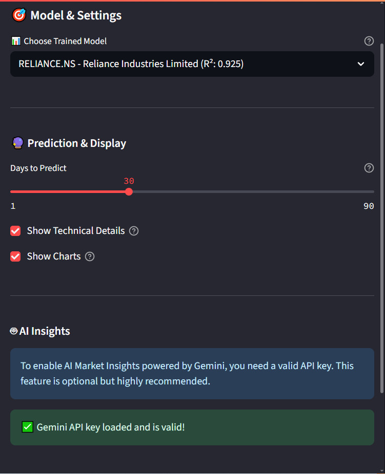 |
| Historical Price Chart | 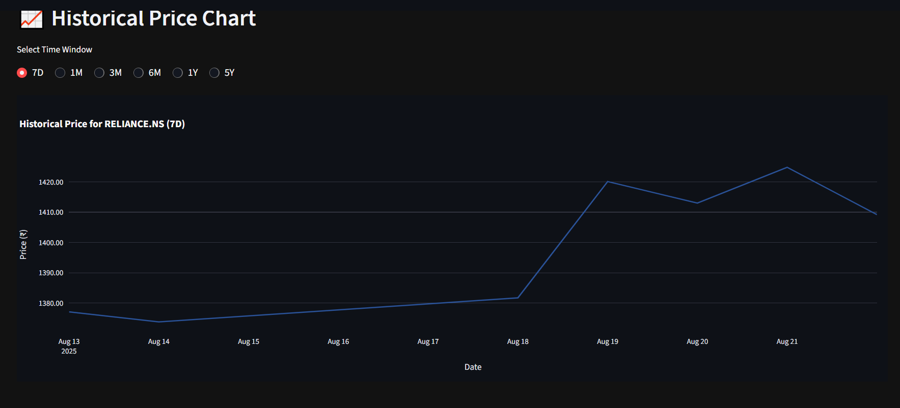 |
| Stock Performance (52W Range) | 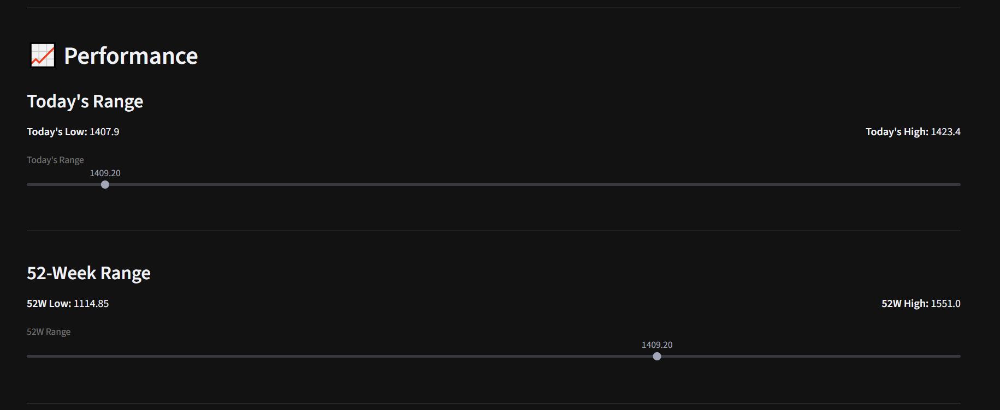 |
| Current Market Status | 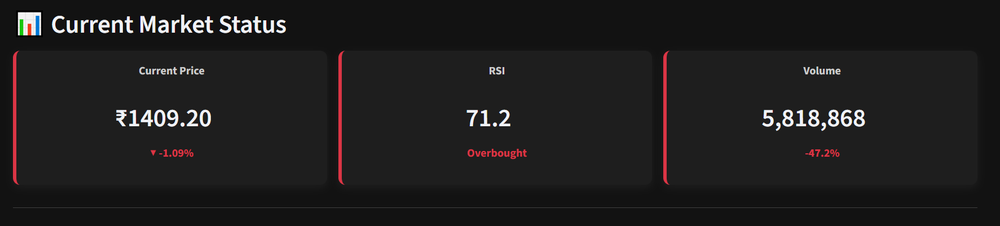 |
| Technical Indicators Table | 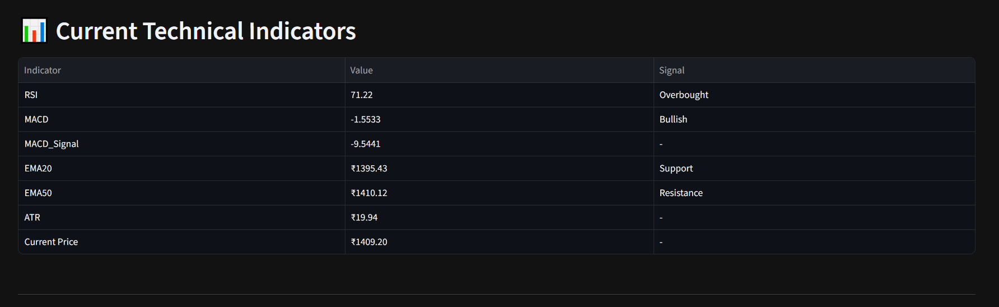 |
| AI Recommendation | 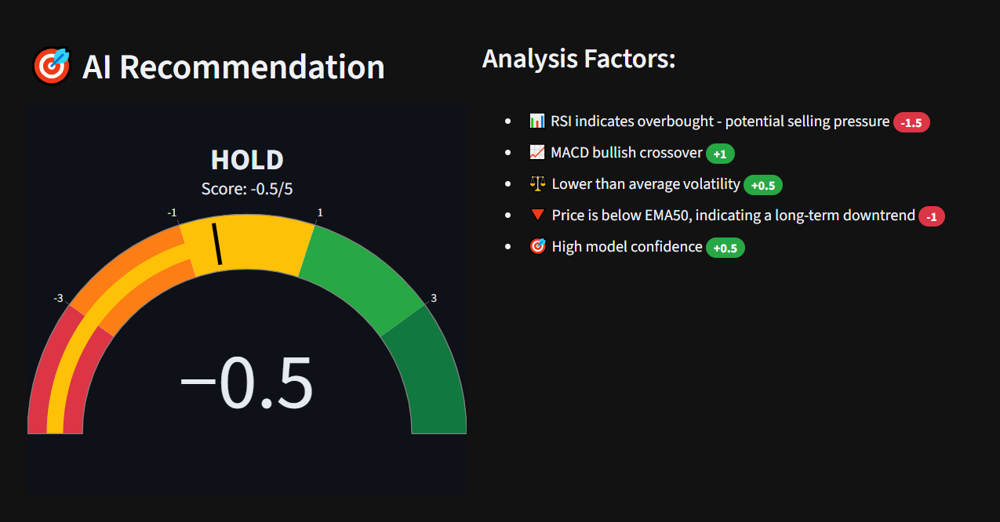 |
| AI Predictions | 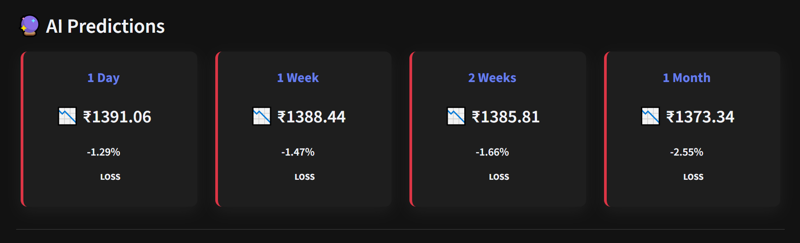 |
| Analysis Chart with Predictions | 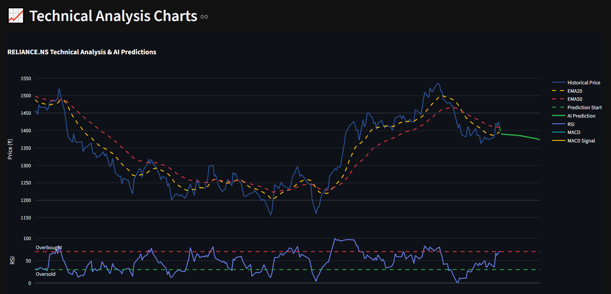 |
| Gemini AI Insights | 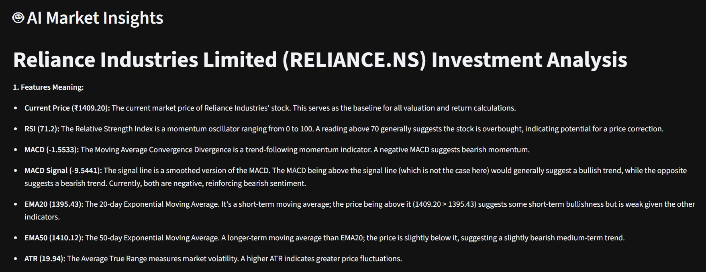 |
| Model Performance Metrics | 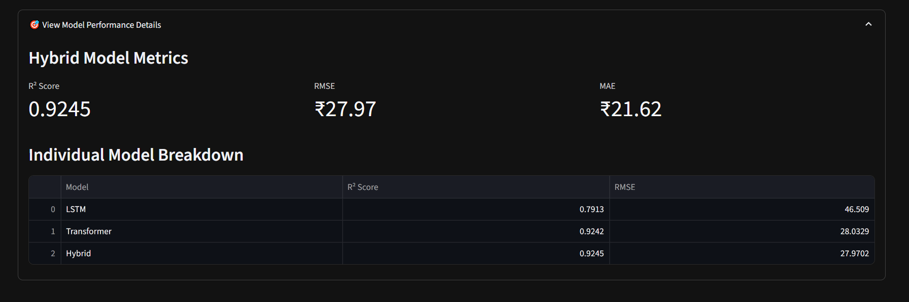 |
---
