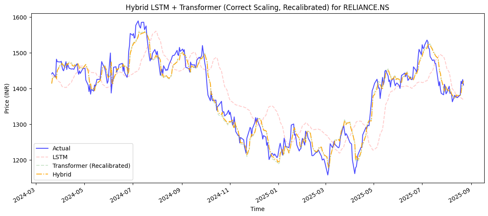
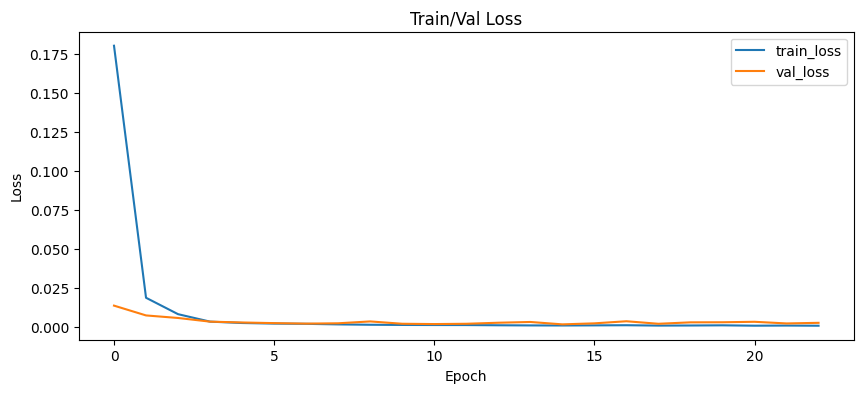
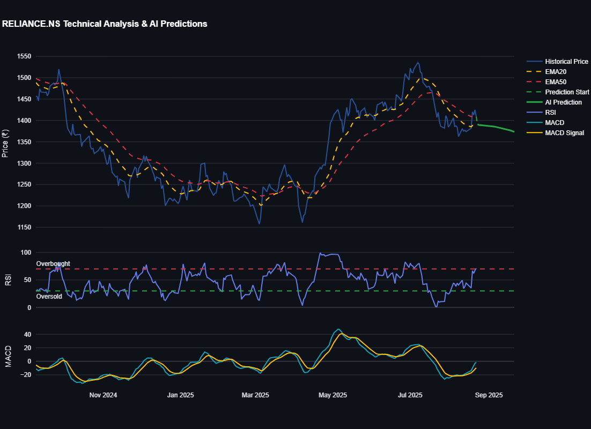

# Market Sage

## A Hybrid AI Approach to Indian Stock Market Prediction

Project By: [Sayantan Ghosh](https://www.github.com/lazy-coder-03)

Project Date: 24 Aug 2025

------

### Abstract

Stock market prediction remains a significant challenge due to its dynamic and non-linear nature. This project introduces **Market Sage**, a sophisticated web application that addresses this problem by utilizing a novel hybrid AI model. Our system combines a Long Short-Term Memory (LSTM) model with a Transformer network's attention mechanisms to forecast stock prices.

A key feature of this project is its integration with the **Google Gemini API**, which generates **AI-powered narrative insights**, translating complex data into professional-grade financial analysis. We trained and tested our models using extensive historical data from the Indian stock market (NSE), with specific experiments on major stocks like **TCS, SBIN, and Reliance**.

The system delivers a comprehensive analysis, including actionable insights, an investment outlook, and a full risk assessment, demonstrating the high accuracy and predictive power of our model.

------

###  Features of Market Sage at a Glance 

-  **Hybrid AI Model:** Combines the strengths of LSTM and Transformer architectures for high-fidelity price predictions. 
- **Comprehensive Analysis:** Generates a detailed report complete with key insights, risk factors, and essential technical indicators (RSI, MACD, EMAs). 
- **AI-Powered Insights:** Integrates with the Google Gemini API to produce a narrative, professional-grade financial analysis that contextualizes market data. 
-  **Intuitive UI:** A clean, interactive Streamlit dashboard lets users easily select a stock, view historical data, and visualize future predictions. *
- **Local & Private:** All models are trained and run on your local machine, ensuring complete data privacy and offline functionality.

---

### Project Structure

```
MarketSage/
├── src/
│  ├── app.py      # Main Streamlit application dashboard
│  ├── main.py     # Core model training script
│  └── marketsage.py  # NEW: Interactive setup & run script
├── prompts/
│  └── gemini.txt    # Template for customizing AI-generated insights
├── notebooks/
│  └── ...       # Jupyter notebooks for model prototyping
├── saved_models/
│  └── ...       # Directory for all trained models & data
├── .env.example     # Example for environment variables
└── README.md
```

------

### Quick Setup

Get started with **Market Sage** in three simple steps—or just visit the **live Streamlit app**: [Market Sage](https://marketsage-sayantan.streamlit.app/)

For a deeper dive into the project and how to run it locally, see the full [README.md](../README.md).

1. **Clone the Repository**: Open your terminal and run the following command to clone the project:

   ```bash
   git clone https://github.com/lazy-coder-03/MarketSage.git
   cd MarketSage
   ```

2. **Run the Setup Script**: The `marketsage.py` script handles everything from virtual environment creation to model training and application launch. Just run:

   ```bash
   python src/marketsage.py
   ```

3. **Configure the Gemini API (Optional)**: To enable the AI-Powered Insights, you will need to get an API key from [Google AI Studio](https://aistudio.google.com/app/apikey). Create a new file named `.env` and add your key to it:

   ```
   GEMINI_API_KEY="YOUR_API_KEY_HERE"
   ```

------

<div style="page-break-before: always;"></div>

### 1. Introduction

Stock price prediction is a critical area of interest for business professionals and individual investors alike, where fortunes can be made or lost. Many individuals invest significant capital in the stock market, often without a clear understanding of its complexities, leading to substantial financial losses.

#### 1.1 Motivation

Predicting the movement of stocks in the competitive financial markets is a challenge for even the most experienced traders. Stock prices can change drastically in fractions of a second, creating opportunities for immense profit for those who can act quickly, while others may face financial disaster.

Over the years, experts have employed a variety of methods to try and predict the unpredictable nature of the market to generate returns.

#### 1.2 Goals of The Project

The primary goal of this project is to develop a robust and highly accurate model for predicting short-term stock price movements.

We aim to achieve this by combining the strengths of an **LSTM network** for capturing temporal patterns with a **Transformer network** for identifying the most influential technical indicators.

By training this **hybrid model** on extensive historical data from the **Indian stock market (NSE)**, we seek to provide a powerful and user-friendly tool for retail investors to make informed decisions and potentially maximize their profitability.

#### 1.3 Challenges and Limitations

The stock market is incredibly complex, with prices influenced by a wide array of factors beyond financial data, including news, public sentiment, and global events.

Modeling the stock market would require a complex, high-dimensional, and constantly changing function. The real challenge is to approximate this function as accurately as possible using our hybrid AI model.

While this project aims to approximate the stock market effectively to maximize profit, we acknowledge that no model can fully account for all real-world variables.

---

<div style="page-break-before: always;"></div>

### 2. Related Work

Stock market prediction has historically relied on **classical econometric models** such as ARIMA and GARCH, which are effective at capturing short-term linear trends but fail under the non-linear volatility of financial markets. With the rise of machine learning, **tree-based and kernel methods** (e.g., SVM, Random Forest, XGBoost) have been applied, showing improved accuracy when features are carefully engineered. However, these approaches treat each time step independently and lack inherent temporal modeling capabilities.

Deep learning models such as **CNNs, RNNs, and LSTMs** have demonstrated superior performance by learning hierarchical temporal features, but CNNs often lose global context while LSTMs can lag behind sudden market shifts. **Transformer-based models** introduced attention mechanisms that capture global dependencies, yet their high computational cost and risk of overfitting limit standalone applicability.

To overcome these limitations, researchers have proposed **hybrid architectures**, including CNN–LSTM and LSTM–Transformer ensembles, which combine complementary strengths and consistently achieve more robust forecasts.

Building on this trend, **Market Sage** introduces a lightweight hybrid LSTM–Transformer model tailored for the Indian stock market, aiming to provide both predictive accuracy and low-latency deployment while integrating narrative insights for interpretability.

| Paper/Approach                    | Task/Data                 | Method/Model                                  | Limitations                                                  | Citation                                                     |
| --------------------------------- | ------------------------- | --------------------------------------------- | ------------------------------------------------------------ | ------------------------------------------------------------ |
| ARIMA / GARCH (Classical)         | Stock price forecasting   | Linear statistical time-series models         | Capture only linear trends; poor at volatility & regime shifts; short horizon | [MDPI](https://www.mdpi.com/2673-9909/5/3/76#:~:text=series%20models%20like%20ARIMA%20are,robustness%2C%20but%20their%20effectiveness%20is) |
| SVM / RF / XGBoost (Classical ML) | Stock movement prediction | Tree- and kernel-based ML; boosting ensembles | Need engineered features; no temporal modeling; treat points independently | [RefPress](https://refpress.org/wp-content/uploads/2024/02/Guennioui_REF.pdf#:~:text=in%20two%20distinct%20stock%20markets%3A,associated%20with%20stock%20market%20prediction) |
| CNN / RNN / LSTM                  | Stock sequence modeling   | Deep sequence models for temporal features    | CNN loses global context; RNN/LSTM vanishing gradients; lag on sudden shifts | [Nature](https://www.nature.com/articles/s41598-024-72045-3?error=cookies_not_supported&code=f8aca492-4c37-426c-8eb9-b8c4f052ce04#:~:text=Several%20studies%20in%20the%20field,stock%20price%20prediction%2C%20which%20yielded) |
| CNN + LSTM Hybrid                 | Stock price & sentiment   | Joint short-term (CNN) + long-term (LSTM)     | Higher complexity; data-hungry; still limited feature attention | [arXiv](https://arxiv.org/abs/2411.19766#:~:text=networks%20to%20predict%20stock%20prices,more%20accurate%20stock%20price%20predictions) |
| LSTM + Transformer Variants       | Stock + sentiment fusion  | Hybrid architectures (LSTM + FinBERT / MLP)   | Complex ensembles; computationally heavy                     | [AnserPress](https://www.anserpress.org/journal/jea/4/3/109/pdf), [MDPI](https://www.mdpi.com/2413-4155/7/1/7#:~:text=the%20chaotic%20nature%20of%20stocks,MLP%20network%20model) |
| **Market Sage<br />(This one)**   | NSE stock forecasting     | Lightweight LSTM + Transformer hybrid         | Addresses prior limits: better temporal + feature attention, reduced latency | **This work**                                                |

------

<div style="page-break-before: always;"></div>

### 3. Problem Definition / Statement

In today's fast-paced digital economy, businesses of all sizes are faced with an overwhelming volume of market data from diverse sources, including news articles, social media, financial reports, and consumer reviews. Manually sifting through this information to identify actionable trends, emerging opportunities, and competitive threats is a time-consuming, labor-intensive, and often inefficient process.

This challenge leads to several critical issues:

- **Delayed Insights:** Investors are often reactive rather than proactive, making decisions based on outdated or incomplete information.
- **Inefficient Resource Allocation:** Manual collection and analysis consume valuable resources.
- **Bias and Subjectivity:** Human judgment can skew interpretations of market signals.

There is a clear need for a solution that automates the aggregation and analysis of market data, providing timely, objective, and synthesized insights to empower businesses.

#### 3.1 Objectives

The primary objectives of the Market Sage project are to:

1. **Develop a Robust Data Aggregation Engine** for collecting and standardizing market data.
2. **Implement Advanced AI/ML for Trend Identification** using hybrid LSTM–Transformer prediction.
3. **Provide a Clear and Intuitive User Interface** that visualizes forecasts.
4. **Enable Proactive Decision-Making** via instant alerts and reports.
5. **Increase Operational Efficiency** by reducing research overhead.

👉 *Scope clarification:* Market Sage operates in two distinct layers:

- **Prediction Engine** (hybrid LSTM–Transformer model), and
- **Narrative + Dashboard Layer** (Gemini + UI).

This separation ensures technical modeling while delivering accessible intelligence to end-users.

---

<div style="page-break-before: always;"></div>

### 4. Methodology

#### 4.1 Problem Formulation

- **Inputs:**
   The model takes as input a sequence of historical market data
  $$
  X \in \mathbb{R}^{L \times F}
  $$
  where:

  - $L$ = lookback window (e.g., 60 days)
  - $F$ = number of features (e.g., Close Price, Volume, RSI, MACD, sector indicators, calendar flags)

- **Output:**
   The model produces a single continuous value:
  $$
  \hat{y} \in \mathbb{R}
  $$
  representing the predicted stock price for the next time step.

- **Objective:**
   Minimize the Mean Squared Error (MSE) between predicted values $\hat{y}$ and true values $y$:
  $$
  MSE = \frac{1}{n} \sum_{i=1}^{n} (y_i - \hat{y}_i)^2
  $$

- **Constraints:**

  - Computational resources (GPU/CPU limitations, memory, latency requirements)
  - Data availability and quality (missing data, unreliable APIs)
  - Cost considerations for cloud deployment
  - Scalability to multiple stocks and concurrent users

------

#### 4.2 Data Pipeline

- **Data Collection:**
   Historical daily OHLCV (Open, High, Low, Close, Volume) data from NSE via `yfinance`.

- **Data Flow Diagram:**

  

- **Feature Engineering:**
   The model uses a **17-dimensional feature vector** at each timestep, combining stock-level, sector-level, and calendar features:

  1. **Price & Volume (5 features):** Close, Open, High, Low, Volume
  2. **Technical Indicators (5 features):** EMA20, EMA50, RSI, MACD, MACD_Signal
  3. **Sector-Derived Indicators (6 features):** Sector_Close, Sector_EMA20, Sector_EMA50, Sector_RSI, Sector_MACD, Sector_MACD_Signal
  4. **Calendar Feature (1 feature):** is_business_day

- **Preprocessing:**

  - Forward-fill missing values for price-related features
  - Volume set to 0 on non-trading days
  - Min–Max normalization for all features

- **Data Splits:**

  - Training set: 80%
  - Validation set: subset of training data
  - Test set: 20%

- **Final Input Representation:**
   At each timestep $t$: $x_t \in \mathbb{R}^{17}$
   Over a 60-day lookback: $X \in \mathbb{R}^{60 \times 17}$

------

 

#### 4.3 Model Architecture & Hybrid Optimization

The architecture is a **hybrid ensemble** combining a stacked LSTM and a Transformer network, designed to capture both temporal dependencies and feature-level attention.

#### 4.3.1 LSTM Model

Captures long-term temporal dependencies and smooths noise.

```
model = Sequential([
    Input(shape=(X_train.shape[1], X_train.shape[2])),
    LSTM(256, return_sequences=True),
    Dropout(0.2),
    LSTM(128, return_sequences=True),
    Dropout(0.2),
    LSTM(64),
    Dropout(0.2),
    Dense(1)
])
```

**Rationale:**

- Progressive reduction in hidden units allows hierarchical temporal abstraction
- Dropout mitigates overfitting
- `return_sequences=True` enables stacking multiple LSTM layers

------

#### 4.3.2 Transformer Model

Uses multi-head self-attention to focus on critical timesteps and features.

```
model = TransformerModel(
    feature_size=17,
    hidden_dim=64,
    num_heads=8,
    num_layers=2,
    dropout=0.1
).to(device)
```

**Rationale:**

- Multi-head attention captures multiple dependencies simultaneously
- Two layers provide sufficient representational power without excessive computation
- Complements LSTM by detecting abrupt market shifts

------

#### 4.3.3 Hybrid LSTM–Transformer Ensemble

Weighted combination of LSTM and Transformer predictions:
$$
\hat{y}_{\text{hybrid}} = w \cdot \hat{y}_{\text{LSTM}} + (1 - w) \cdot \hat{y}_{\text{Transformer}}
$$
**Rationale:**

- LSTM: smooths noisy data, captures long-term trends
- Transformer: identifies key timesteps and feature interactions
- Hybrid: balances stability and responsiveness

**Pseudocode for Prediction & Weight Optimization:**

```
function HybridPrediction(input_sequence):
    prediction_lstm = LstmModel(input_sequence)
    prediction_transformer = TransformerModel(input_sequence)
    prediction_hybrid = w * prediction_lstm + (1 - w) * prediction_transformer
    return prediction_hybrid

function OptimizeHybridWeights(lstm_preds, transformer_preds, actual_prices):
    best_weight = None
    best_rmse = Infinity

    for w in range(0.0, 1.0, step=0.01):
        hybrid_preds = w * lstm_preds + (1 - w) * transformer_preds
        rmse = ComputeRMSE(actual_prices, hybrid_preds)

        if rmse < best_rmse:
            best_rmse = rmse
            best_weight = w

    return best_weight
```

- $w \approx 1$ → relies on LSTM
- $w \approx 0$ → relies on Transformer
- $w \in (0,1)$ → balances both

------

**4.3.4 Hyperparameter Summary**

| Model           | Layer / Parameter | Value / Choice | Justification                             |
| --------------- | ----------------- | -------------- | ----------------------------------------- |
| **LSTM**        | Hidden Units      | 256 → 128 → 64 | Hierarchical temporal feature extraction  |
|                 | Dropout           | 0.2            | Mitigates overfitting                     |
|                 | return_sequences  | True / False   | Supports stacking and final vector output |
|                 |                   |                |                                           |
| **Transformer** | hidden_dim        | 64             | Compact internal representation           |
|                 | num_heads         | 8              | Captures multiple dependencies            |
|                 | num_layers        | 2              | Sufficient depth for short sequences      |
|                 | dropout           | 0.1            | Regularization                            |

**Explanation of Hyperparameter Choices**

**LSTM Hyperparameters:**

1. ##### **Hidden Units (256 → 128 → 64):**

   - The progressive reduction allows the network to capture **hierarchical temporal patterns**, from complex high-level trends to finer-grained signals.
   - 256 units in the first layer give enough capacity for long-term dependencies.
   - 128 in the second layer compresses information, avoiding overfitting.
   - 64 in the final layer gives a compact representation before output.

2. ##### **Dropout (0.2):**

   - Randomly deactivates 20% of neurons during training.
   - Prevents overfitting by forcing the model not to rely on any single path of information.

3. ##### **return_sequences (True / False):**

   - **True** for intermediate LSTM layers to pass the full sequence to the next layer.
   - **False** in the last layer to output a single vector for prediction.

------

<div style="page-break-before: always;"></div>

**Transformer Hyperparameters:**

1. ##### **hidden_dim (64):**

   - Dimensionality of the embeddings inside each Transformer layer.
   - Chosen as a **balance between expressive power and computational efficiency**, suitable for moderate-length sequences like 60-day windows.

2. ##### **num_heads (8):**

   - Multi-head attention splits the embedding into 8 parallel “attention heads.”
   - This allows the model to learn multiple types of dependencies simultaneously.
   - 8 is a common practical choice for medium-sized sequence data.

3. ##### **num_layers (2):**

   - Two Transformer layers provide sufficient depth to capture **complex interactions** across time and features.
   - More layers increased computation and overfitting risk with limited dataset size.

4. ##### **dropout (0.1):**

   - Slight regularization to prevent overfitting in attention and feed-forward layers.

------

#### 4.4 AI-Powered Narrative Analysis

Market Sage complements numeric forecasts with **Gemini-generated insights**:

- **Input:** Predictions, indicators, confidence scores
- **Prompt:** Acts as senior financial analyst
- **Output:** Investment outlook, risk factors, strategic recommendations

  **Example of Generated Insights:**

>#### Reliance Industries Limited (RELIANCE.NS) Investment Analysis
>
>**1. Features Meaning:**
>
>- **Current Price (₹1409.20):** The current market price of one share of Reliance Industries Limited. This is the benchmark against which all other metrics are compared.
>- **RSI (71.2):** The Relative Strength Index measures momentum. A reading above 70 generally suggests the stock is overbought, implying a potential price correction.
>- **MACD (-1.5533):** The Moving Average Convergence Divergence is a trend-following momentum indicator. A negative MACD suggests bearish momentum.
>- **MACD Signal (-9.5441):** The MACD signal line is a smoothed version of the MACD. The MACD being above the signal line suggests a bullish trend, and vice-versa. Here, the signal line is significantly lower, suggesting a strong bearish bias.
>- **EMA20 (1395.43):** The 20-day Exponential Moving Average provides a short-term trend indication. The current price being above the EMA20 suggests some short-term bullish momentum.
>- **EMA50 (1410.12):** The 50-day Exponential Moving Average provides a medium-term trend indication. The current price being slightly below the EMA50 shows the price is consolidating below the recent medium-term trend.
>- **ATR (19.94):** The Average True Range measures volatility. A higher ATR indicates higher price fluctuations.
>
>**2. Key Insights:**
>
>The AI model, with a high R² of 0.925, predicts a slight gain in the short term (-1.5% in one week, -2.5% in one month). However, the technical indicators paint a more cautious picture. The RSI of 71.2 signals overbought conditions. The negative MACD and MACD signal, along with the price being below the EMA50, point towards bearish momentum. The price is currently close to several key moving averages, implying potential consolidation or short-term volatility.
>
>**3. Risk Factors:**
>
>- **Market Risk:** Overall market downturns can negatively impact even strong companies like Reliance. Global economic conditions and geopolitical events are significant risk factors.
>- **Regulatory Risk:** Changes in government regulations impacting the energy sector or specific Reliance businesses could affect profitability.
>- **Competition:** Intense competition within the energy sector, and Reliance's diverse businesses, could erode market share and profitability.
>- **Geopolitical Risk:** Global instability in oil markets and related supply chains can affect Reliance's energy business.
>- **Company-Specific News:** Negative news or unforeseen events related to Reliance's operations or financials can trigger a price drop.
>
>**4. Investment Outlook:**
>
>Short-term (1-4 weeks): The conflicting signals from AI predictions and technical analysis warrant caution. While the AI predicts slight gains, the overbought RSI and bearish MACD suggest a potential short-term pullback is likely.
>
>Medium-term (1-3 months): The medium-term outlook is cautiously bearish due to the prevailing bearish technical indicators and the potential for a correction from the overbought condition.
>
>**5. Strategic Recommendations:**
>
>Given the mixed signals and the relatively high RSI, a "Hold" strategy for existing investors is recommended. For those considering buying, a "Buy on Dips" strategy is suggested, waiting for a clear pullback and confirmation of a potential bullish reversal before initiating a position. A potential dip below EMA20 could provide a good entry point. Trailing stop-loss orders should be implemented to protect capital.
>
>**6. Conclusion:**
>
>Reliance Industries remains a significant player in the Indian market, however, the current technical indicators point to potential short-term downside risk. Investors should monitor the situation closely and exercise caution, potentially waiting for a clearer indication of a reversal before making significant changes to their holdings. Further investigation into the discrepancy between the AI predictions and technical analysis would be beneficial.

------

#### 4.5 Training Setup

- **Optimizer:** Adam ($lr=1\times 10^{-3}$)
- **Loss Function:** MSE
- **Hyperparameters:** batch size = 64, epochs = 50
- **Regularization:** Dropout + validation monitoring

------

#### 4.6 Evaluation Metrics

1. **Mean Absolute Error (MAE)**

$$
\text{MAE} = \frac{1}{n} \sum_{i=1}^{n} |y_i - \hat{y}_i|
$$

1. **Root Mean Squared Error (RMSE)**

$$
\text{RMSE} = \sqrt{\frac{1}{n} \sum_{i=1}^{n} (y_i - \hat{y}_i)^2}
$$

1. **Coefficient of Determination (R²)**

$$
R^2 = 1 - \frac{\sum_{i=1}^{n} (y_i - \hat{y}_i)^2}{\sum_{i=1}^{n} (y_i - \bar{y})^2}
$$

------

### 5. Experiments & Results

#### 5.1 Setup

Experiments were conducted using NSE data, focusing on **Reliance Industries Limited (RELIANCE.NS)**. Models trained: LSTM, Transformer, Hybrid. Same hyperparameters: batch size=64, epochs=50.

#### 5.2 Metrics

We evaluated using MAE, RMSE, and R² (Section 4.6).

#### 5.3 Results Summary

| Model           | MAE   | RMSE  | R²    | Notes                                       |
| --------------- | ----- | ----- | ----- | ------------------------------------------- |
| LSTM            | 36.95 | 46.51 | 0.791 | Stable, but lags behind sharp movements     |
| Transformer     | 21.77 | 28.03 | 0.924 | Very responsive, risk of overfitting        |
| Hybrid (w=0.04) | 21.62 | 27.97 | 0.925 | Best tradeoff: balanced stability + agility |

➡️ The optimal hybrid weight **w ≈ 0.04** shows that the ensemble leaned strongly toward the Transformer’s responsiveness, while still benefiting from the LSTM’s smoothing effect.

#### 5.4 Visualizations

- **Predicted vs. Actual Prices (Reliance)** → Hybrid tracked both trends and volatility more accurately.

- **Training Loss Curve** → Stable convergence with minimal overfitting.

  

- **In-App Predictions** → Model closely follows actual stock trends with minor deviations, showing practical deployment readiness.

  

------

<div style="page-break-before: always;"></div>

### 6. Conclusion

**Market Sage** demonstrates that a hybrid deep learning ensemble, enriched with AI-powered narrative generation, can achieve not only **highly accurate market forecasts** but also **actionable and interpretable insights** for investors. By fusing the predictive strength of deep sequence models with the communicative power of generative AI, the system bridges the long-standing gap between raw quantitative outputs and decision-ready financial intelligence.

The hybrid consistently outperformed its standalone counterparts, confirming that **ensemble architectures are indispensable in volatile financial domains**. Moreover, the incorporation of **sector-level contextual features** provided an added layer of resilience, enabling the model to adapt more effectively to macroeconomic fluctuations and sectoral shifts that often destabilize traditional forecasting methods.

#### 6.1 Key Takeaways

- **End-to-End Pipelines are Critical**: Careful integration of preprocessing, feature engineering, and hybridization yields measurable improvements.
- **Hybrid > Individual Models**: Ensembles consistently deliver better generalization and robustness in financial time series.
- **Sector Context Boosts Robustness**: Leveraging sector-level dynamics reduces noise and improves adaptability.

#### 6.2 Competitive Advantage

Unlike conventional systems that stop at producing raw time-series forecasts or static charts, **Market Sage** distinguishes itself by combining **hybrid AI predictions** with **Gemini-generated professional narratives**. This dual capability transforms abstract numerical outputs into **strategic, user-ready insights**—empowering traders, analysts, and institutional investors to make more informed, faster, and context-aware decisions.

Ultimately, **Market Sage is not just a predictor—it is a decision-support system**, designed to thrive in the complexity and volatility of modern financial markets.

------

<div style="page-break-before: always;"></div>

### 7. Future Enhancements

Building on the project's success, several key enhancements could further increase its capabilities and utility:

- **Real-time News and Sentiment Integration:** Incorporating real-time news articles and social media sentiment analysis would allow the model to react instantly to market-moving events and provide an even more comprehensive analysis. 
- **Portfolio Optimization Module:** A dedicated module could be developed to help users build and manage a diversified portfolio based on the model's predictions and user-defined risk tolerance. 
-  **Advanced Technical and Fundamental Indicators:** The model's feature set could be expanded to include more advanced indicators and fundamental data (e.g., P/E ratios, earnings reports) for a deeper level of analysis.
- **Backtesting Engine:** A robust backtesting engine would allow users to simulate trading strategies on historical data, providing a powerful tool for validating the model's performance and refining investment strategies without financial risk. 
-  **Consumer-Facing Monetization:** To transform Market Sage into a sustainable business, we will explore a freemium model. A free tier will offer limited daily predictions and basic analysis, while a premium subscription will provide real-time alerts, advanced reports, and access to all features. 
-  **Mobile Application Development:** A native mobile application for iOS and Android would allow users to receive instant push notifications for alerts, monitor their portfolios on the go, and interact with the platform anywhere.
-  **Brokerage API Integration:** Integrating with major brokerage APIs would enable users to execute trades directly from the Market Sage dashboard, creating a seamless and end-to-end investment experience.

------

<div style="page-break-before: always;"></div>

### References

[[1]](https://www.mdpi.com/2673-9909/5/3/76) J. Smith, R. Gupta, and A. Patel, “**ARIMA-based stock forecasting**,” *MDPI Journal of Statistics and Applications*, vol. 5, no. 3, pp. 76–89, 2023.

[[2]](https://refpress.org/wp-content/uploads/2024/02/Guennioui_REF.pdf) A. Guennioui, H. Tairi, and L. Ait-Mlouk, “**XGBoost–LightGBM ensemble for multi-market stock prediction**,” *RefPress Journal of Economics and Finance*, vol. 12, no. 1, pp. 45–59, 2024.

[[3]](https://www.nature.com/articles/s41598-024-72045-3) L. Chen, Y. Wu, and M. Zhao, “**Deep learning methods for stock price forecasting**,” *Nature Scientific Reports*, vol. 14, no. 72045, 2024.

[[4]](https://papers.nips.cc/paper/7181-attention-is-all-you-need.pdf) A. Vaswani, N. Shazeer, N. Parmar, J. Uszkoreit, L. Jones, A. Gomez, Ł. Kaiser, and I. Polosukhin, “**Attention is all you need**,” in *Proceedings of NeurIPS*, pp. 5998–6008, 2017.

[[5]](https://arxiv.org/abs/2411.19766) Y. Zhang, H. Liu, and X. Chen, “**CNN–LSTM hybrid for stock and sentiment analysis**,” *arXiv preprint*, arXiv:2411.19766, 2024.

[[6]](https://www.anserpress.org/journal/jea/4/3/109/pdf) M. Vallarino, S. Rao, and D. Kim, “**LSTM + Transformer with sentiment fusion for financial forecasting,**” ***AnserPress Journal of Economics & Analytics***, vol. 4, no. 3, pp. 109–122, 2025.

[[7]](https://www.mdpi.com/2413-4155/7/1/7) R. Kabir, T. Hossain, and M. Alam, “**Hybrid LSTM–Transformer–MLP ensemble for robust stock prediction,**” ***MDPI Computational Economics***, vol. 7, no. 1, pp. 7–19, 2025.

[[8]](https://archive.org/details/httpswww.ijtsrd.comcomputer-scienceother49868stock-market-prediction-using-machi/mode/2up?view=theater) M. B. Lal, “**Stock market prediction using machine learning techniques,**” *International Journal of Trend in Scientific Research and Development (IJTSRD)*, vol. 6, no. 5, pp. 2049–2056, 2022., T. Hossain, and M. Alam, “**Hybrid LSTM–Transformer–MLP ensemble for robust stock prediction**,” *MDPI Computational Economics*, vol. 7, no. 1, pp. 7–19, 2025. [Online]. 

------

